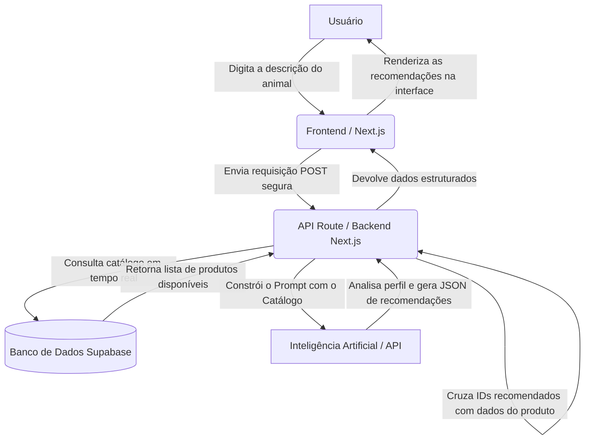

# Arquitetura do Sistema - Reino Pet

🚀 **Aplicação em Produção:** [https://reinopet.vercel.app/](https://reinopet.vercel.app/)

O Reino Pet foi construído seguindo uma arquitetura moderna e escalável de aplicação web, dividindo as responsabilidades entre o cliente (navegador), o servidor intermediário (Next.js) e serviços de nuvem especializados (Supabase e Google Gemini / OpenAI). A aplicação (frontend e backend intermediário) está hospedada na **Vercel**.

## Diagrama Simples de Integração da IA

O fluxo abaixo descreve especificamente como o **Assistente de IA** processa o pedido do usuário e devolve uma recomendação inteligente baseada nos produtos reais da loja.

## Componentes da Arquitetura

1. **Frontend (React Server Components e Client Components)**
   - Gerencia a interface do usuário.
   - Componentes que precisam de interatividade (como o `PetAssistant` ou carrinho) utilizam `"use client"`.
   - Comunica-se com o backend interno do Next.js.

2. **Backend Intermediário (Next.js API Routes)**
   - O arquivo `route.ts` age como um servidor Node.js intermediário.
   - **Objetivo crucial de segurança:** Esconder a chave da API da Inteligência Artificial. Se o frontend chamasse a IA diretamente, a chave secreta seria exposta no navegador do usuário.

3. **Banco de Dados (Supabase)**
   - Armazena as entidades do sistema (Tabela `produtos`).
   - Fornece funções RPC (Remote Procedure Call) para buscas e filtros otimizados no lado do servidor (banco de dados).

4. **Inteligência Artificial (Google Gemini)**
   - Processa a linguagem natural enviada pelo usuário.
   - Atua como o "cérebro" das recomendações, associando a descrição (ex: "pelo sensível") com características dos produtos disponíveis no catálogo que foi injetado via contexto pelo backend.
